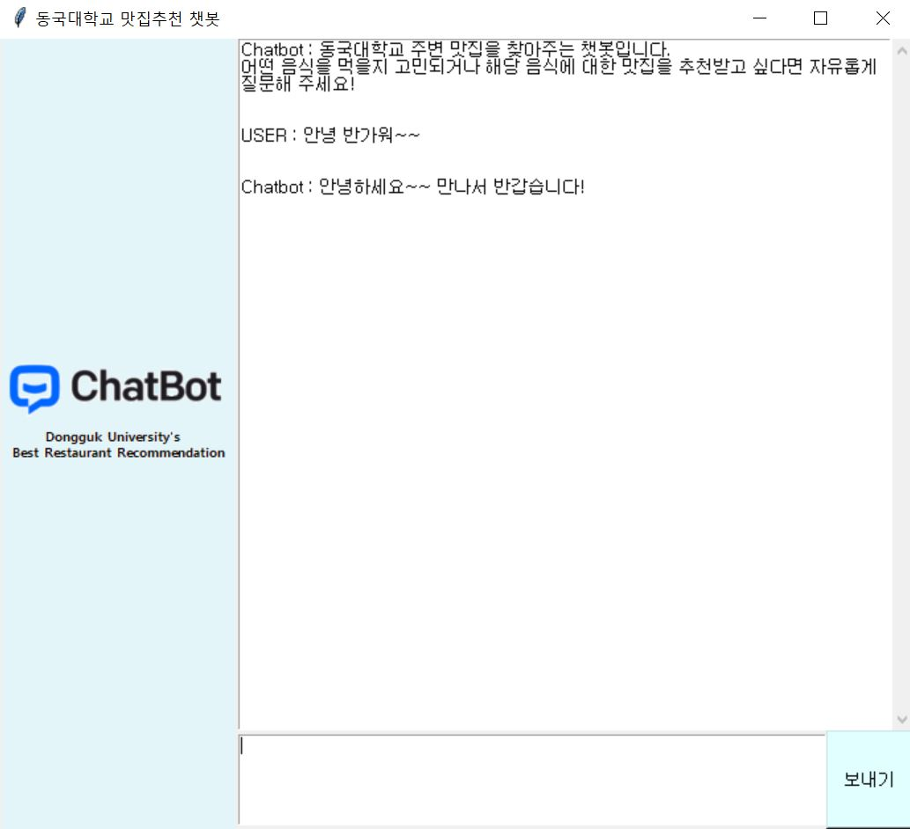
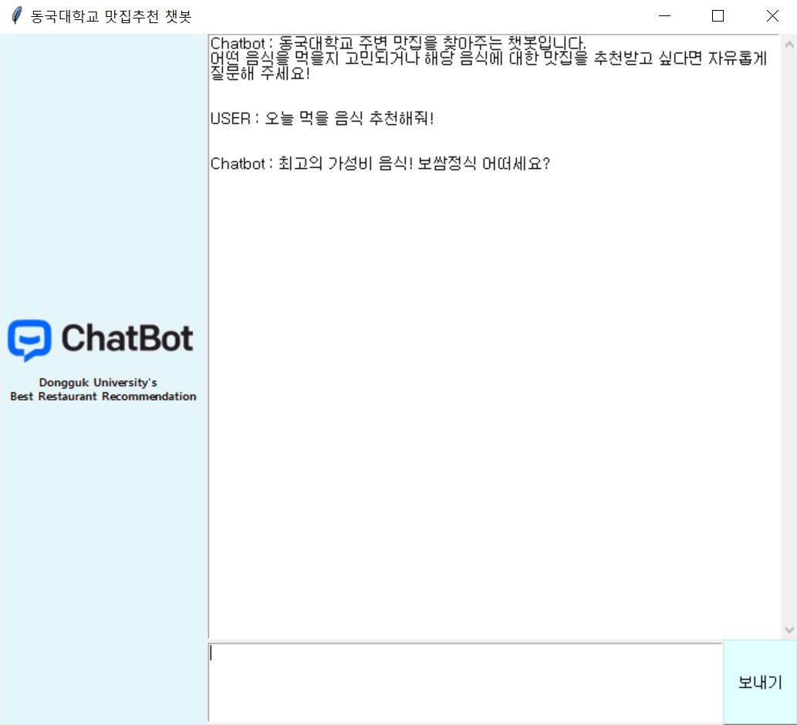
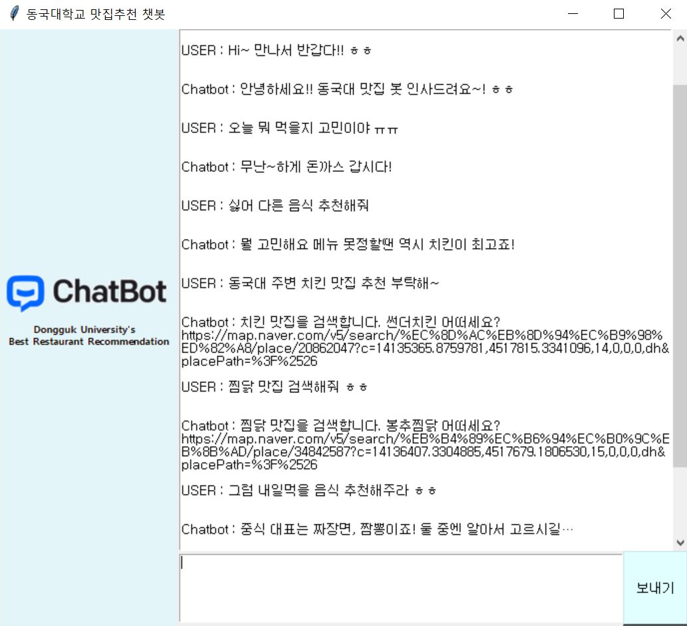

# Chatbot_Project

### Project Introduction
- 목적 : 동국대학교 주변 맛집을 추천해주는 딥러닝 챗봇 개발
- 사용 언어 : PYTHON
- 주요 패키지 : tensorflow, pandas, tkinter

### Project Description
- 인사

- 욕설

- 음식추천

- 음식점추천

- GUI 및 사용예시

